# Mermaid 图表示例

## 1. 流程图 (Flowchart)

### 基本语法

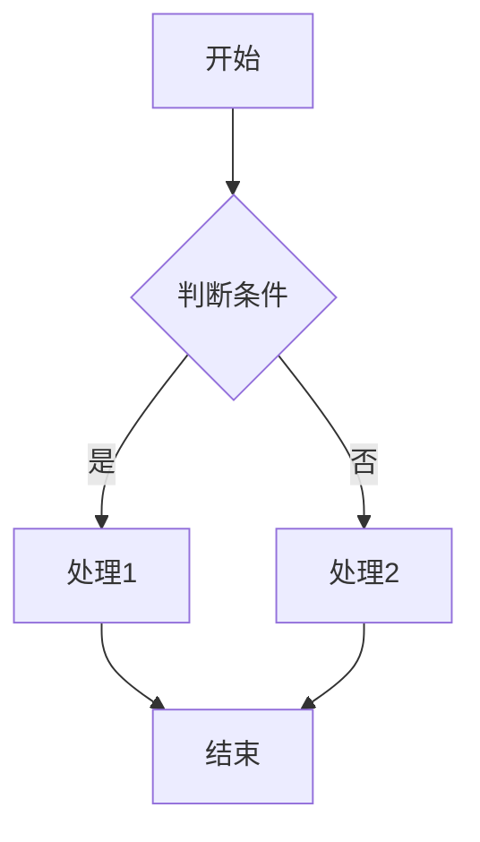

awdawdaw
awdwadaw

awdawdwa
awdaw

### 实际应用：用户登录流程

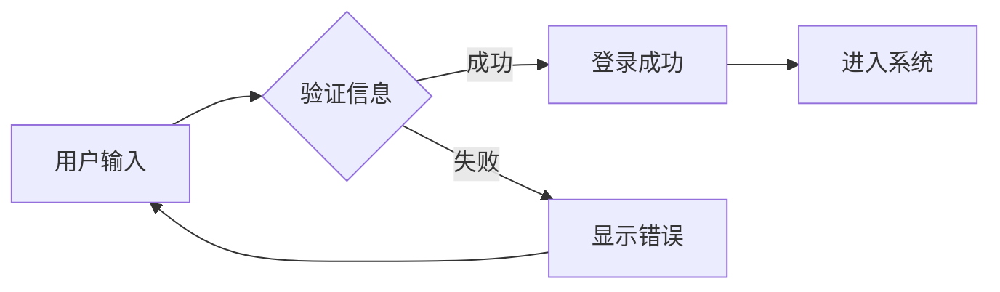

## 2. 时序图 (Sequence Diagram)

### 基本语法

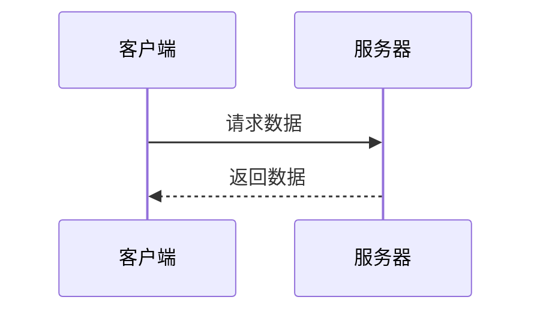

### 实际应用：支付流程

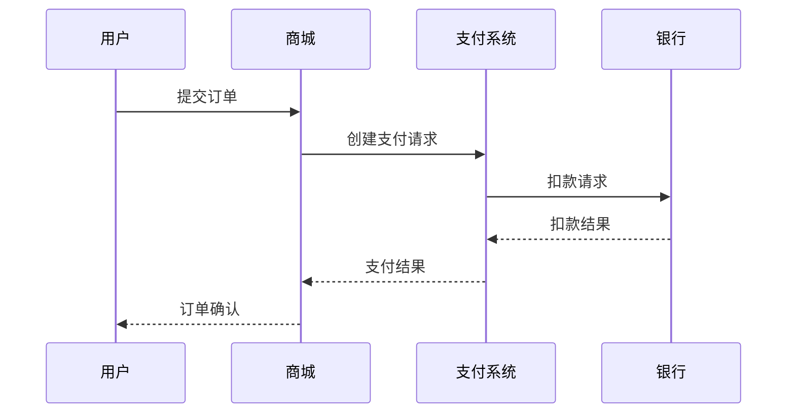

## 3. 甘特图 (Gantt Chart)

### 基本语法

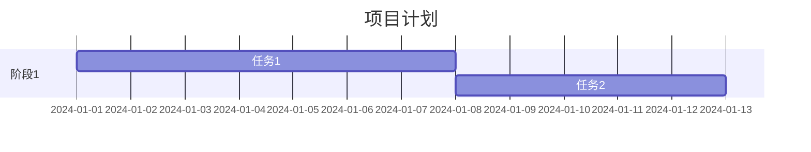

### 实际应用：软件开发进度

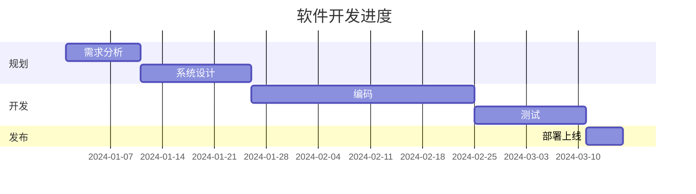

## 4. 类图 (Class Diagram)

### 基本语法

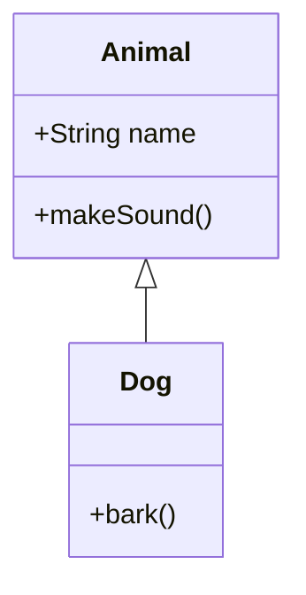

### 实际应用：电商系统

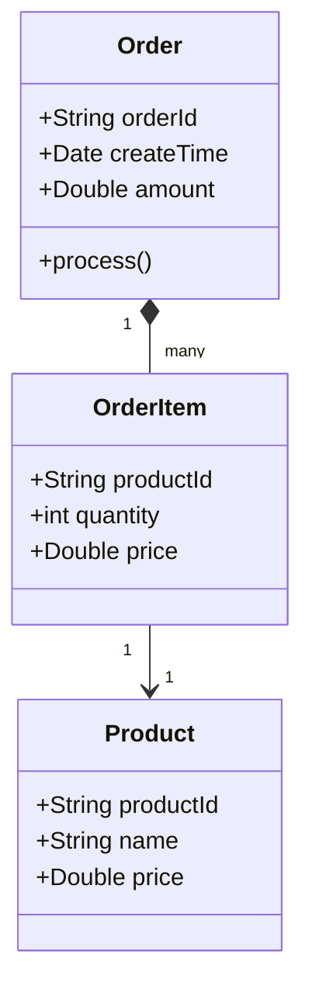

## 5. 状态图 (State Diagram)

### 基本语法

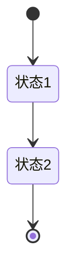

### 实际应用：订单状态流转

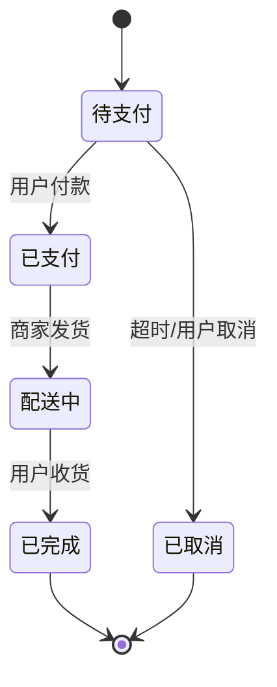

## 6. 饼图 (Pie Chart)

### 基本语法

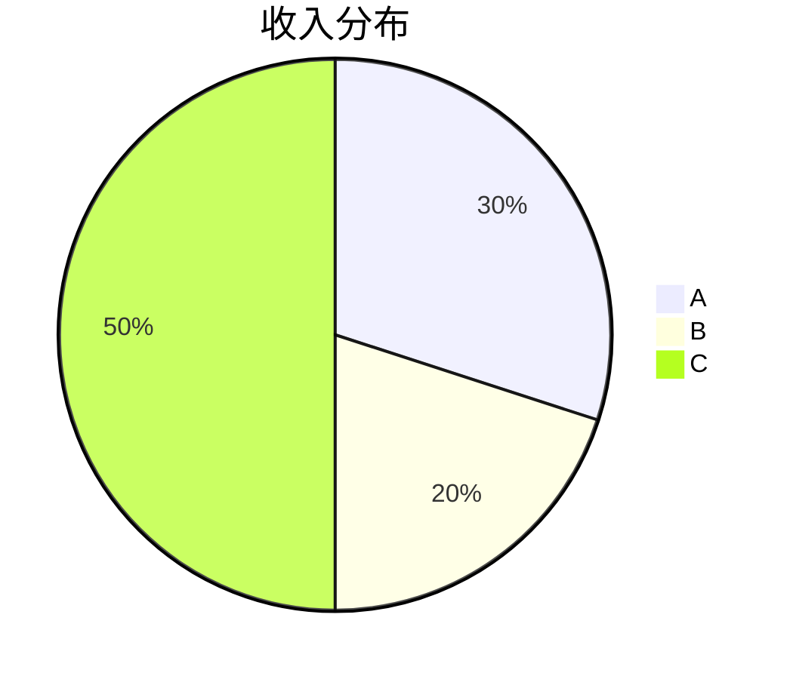

### 实际应用：用户分布

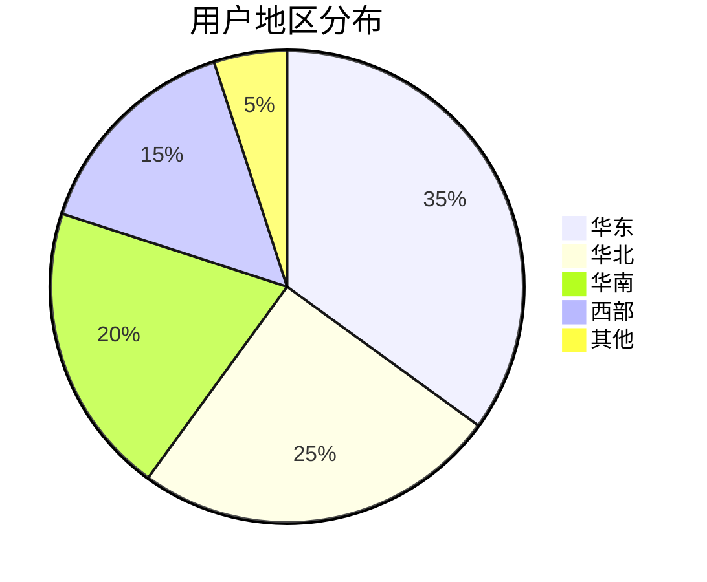

## 使用提示

1. 在 Markdown 文件中使用时，将图表代码放在 \`\`\`mermaid 代码块中
2. 确保你的编辑器或平台支持 Mermaid 图表渲染
3. 可以使用在线 Mermaid 编辑器进行调试
4. 注意不同平台对 Mermaid 语法支持可能有差异
